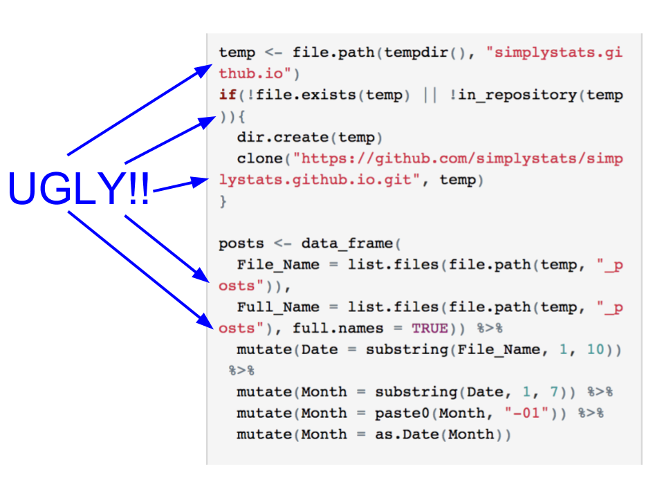

Every once in a while I come across a friend's blog post where they're writing
some code that just doesn't look pretty on mobile. Here's an example from a
recent post on this blog:



The way the text wraps around just looks yucky to me. Thankfully there's a
solution! Make it possible for your code blocks to scroll from side to side
by adding the following to your CSS:

```css
pre code {
  overflow: auto;
  word-wrap: normal;
  white-space: pre;
}
```

Then gaze upon the resulting beauty:


If you want to add this feature to a simple R Markdown document, you can put
the code above in a file called `styles.css`, then you can use it in your
document with the following yaml front matter:

```yaml
---
output: 
  html_document:
    css: styles.css
---
```

Your mobile readers will thank you! If you want to see how this was implemented
on a real blog check out [this pull request](https://github.com/ShanEllis/ShanEllis.github.io/pull/1/commits/35c0f3064d3ec2d7b6e35790448994bdb1233f79).