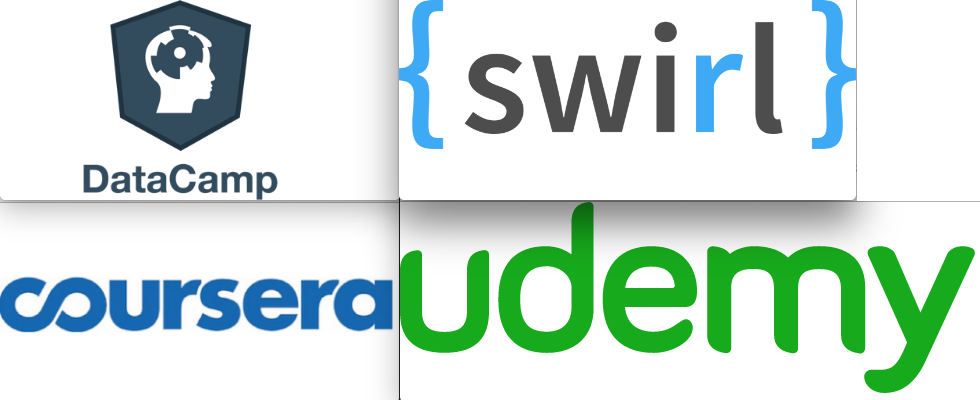
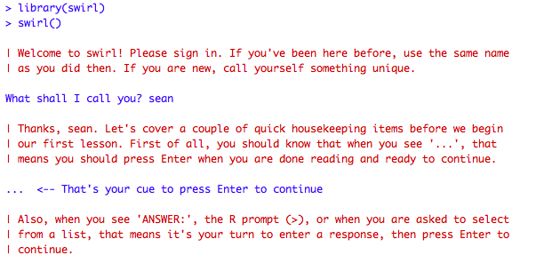
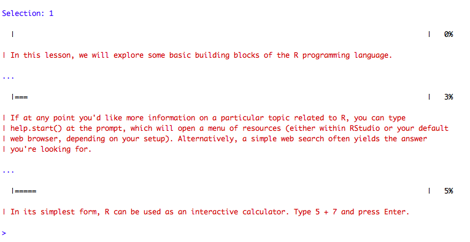
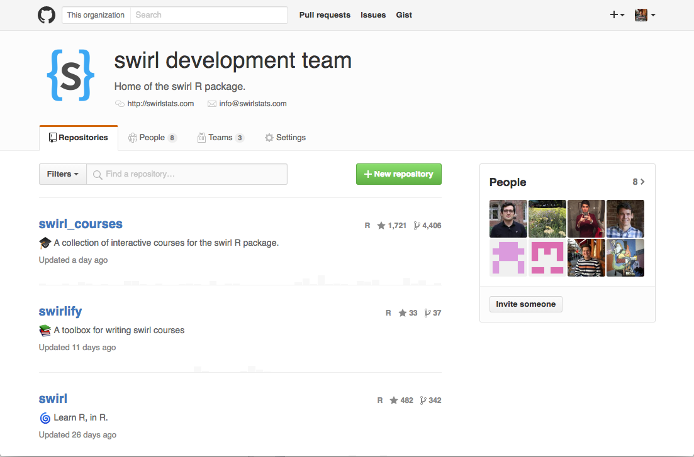

## Who am I?

- Genomics at New York University
- Computer Science at The University of Maryland
- Statistics at Johns Hopkins University

- Currently I work in the Department of Biostatistics at JHU
- The path I've taken is problematic.

## What is this talk about?

- What is data science?
- What is data science education?
- How can we scale data science education? 
(And by "we" I mean you and I because I need your help!)

## What is Data Science?: Process

https://github.com/rstudio/RStartHere

## What is Data Science?: Skills

The tip of the iceberg: 

(Probably and American colloquialism (sorry))

- Computer Science
    - Machine Learning
    - Distributed Computing
    - Parallel Computing
    - Algorithms
- Statistics
    - Inference
    - Regression

- \+ the scientific methods from a specific field (genomics,
sociology, molecular gastronomy, etc)

## Data Science Education: Motivation

<blockquote class="twitter-tweet" data-lang="en">
A data scientist should be able to ... My favourite slide from <a href="https://twitter.com/joelgrus">@joelgrus</a>&#39;s fun talk <a href="https://twitter.com/hashtag/ddtx16?src=hash">#ddtx16</a> <a href="https://t.co/GBlaR7Y5Yf">pic.twitter.com/GBlaR7Y5Yf</a>
&mdash; Jenny Bryan (@JennyBryan) <a href="https://twitter.com/JennyBryan/status/688866722980364289">January 17, 2016</a></blockquote>

What is the underlying concept here?

## What is Data Science Education?

- How can we most effectively teach students to manipulate
and interrogate data using a computer?
- How can we scale this kind of education to millions
of people?
- How can we improve upon issues that are currently present
in computer science and mathematics education?

## Attempts at Scaling Data Science Education

## What is swirl?

## What is swirl?

- swirl is an R package that turns the R console into an 
interactive learning environment for data science.
- swirl takes advantage of the R console's call-and-response
behavior.
- swirl provides an authentic environment, there is no
separation between where a student is learning data science
and where they will go on to practice data science.

## What problems does swirl solve?

- swirl is free and open source, and it always will be.
- swirl is available in multiple langauges (we're always 
looking for volunteer translators!)
- Anyone can make and distribute their own swirl course for
free.

## What a swirl course?

- A swirl course is a collection of lessons.
- Each lesson contains about 20 minutes of instruction
about a particular topic in data science.
- Lessons are written and structured using yaml and R.

## Demo

## swirl

## swirl

## Coming to swirl this summer:

- Improved lessons
- More courses
- Better channels for distributing swirl courses
- Feedback for course instrcutors to assess student's 
performance.

## We want you!

## Questions?

- Find me:
    - On Twitter: @seankross
    - On GitHub: seankross
    - Online: http://seankross.com
    - Email me: sean@seankross.com
    
- Find swirl:
    - On Twitter: @swirlstats
    - On GitHub: swirldev
    - Online: http://swirlstats.com
    - Email swirl: info@swirlstats.com